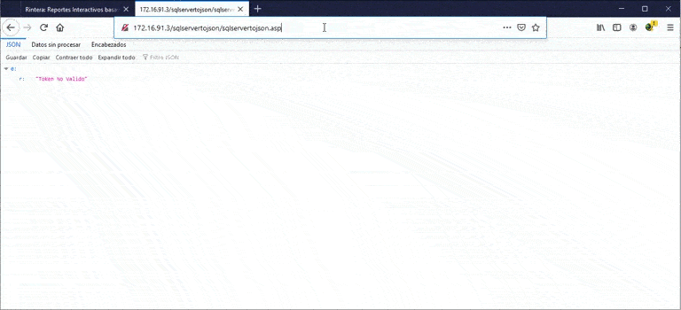

# sqlservertojson
WebService en ASP Classic, para servidores que tengan acceso a bases de datos MSSQL-Server; convierte las consultas en JSON.

Lenguaje: ASP Classic

Si te sive, aprovechalo
JPedraza, printepolis@gmail.com
